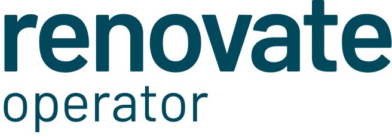

<div align="center">
    
</div>

<br>

[](https://artifacthub.io/packages/helm/mogenius/renovate-operator)

[](https://github.com/mogenius/renovate-operator/actions/workflows/release.yaml)

---

[Renovate][1] is one of, if not the leading tool for automated dependency updates.

With tools like [Mend Renovate][2] you can easily use renovate for free.

But what if you want to run renovate on your own hardware? What if you are running a private GitLab instance? Or just want better control over the scheduling of your renovate executions?

If you are already running Kubernetes, this project might be for you.

### How it works

1. At the defined time of your schedule, a renovate discovery job is started
2. After the discovery finished, you will be able to see all your discovered projects in the UI
3. All projects are now being set to be scheduled
4. Every 10 seconds the operator checks for schedules projects and starts a new renovate job
5. Only as many jobs as defined in `spec.parallelism` are getting executed at the same time


## Installation

### Helm

#### Option 1: OCI Registry

```sh
helm -n renovate-operator upgrade --install renovate-operator \
  oci://ghcr.io/mogenius/helm-charts/renovate-operator \
  --create-namespace --wait
```

#### Option 2: Helm Repository

```sh
helm repo add mogenius https://helm.mogenius.com/public --force-update
helm -n renovate-operator upgrade --install renovate-operator mogenius/renovate-operator --create-namespace --wait
```

## Documentation

- Platforms
  - [GitLab](./docs/platforms/gitlab.md)
  - [GitHub PAT](./docs/platforms/github-pat.md)
  - [GitHub App - External Secrets Operator](./docs/platforms/github-app-eso.md)
  - Native GitHub App Support - We are still working on that
- [Autodiscovery](./docs/autodiscovery.md)
- Webhook API
  - [Generic](./docs/webhooks/webhook.md)
  - [GitLab](./docs/webhooks/gitlab.md)
  - [GitHub](./docs/webhooks/github.md)
- [Using a config.js](./docs/extra-volumes.md)
- [Scheduling](./docs/scheduling.md)

## Contributing

<a href="https://github.com/mogenius/renovate-operator/graphs/contributors">
  
</a>

Made with [contrib.rocks](https://contrib.rocks).

## Development

### Running Tests

Run the test suite:

```sh
go test -v ./...
```

### Code Quality

Run golangci-lint locally:

```sh
go install github.com/golangci/golangci-lint/cmd/golangci-lint@latest
golangci-lint run
```

### Generate CRDs

```sh
controller-gen crd paths=./src/... output:crd:dir=charts/renovate-operator/crds
```

[1]: https://github.com/renovatebot/renovate
[2]: https://docs.mend.io/renovate/latest/
