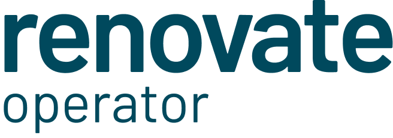

<div align="center">
    
</div>

<br>

[](https://artifacthub.io/packages/helm/mogenius/renovate-operator)

[](https://github.com/mogenius/renovate-operator/actions/workflows/release.yaml)

---

# Renovate: The Kubernetes-Native Way

Run [Renovate][1] on your own infrastructure with CRD-based scheduling, parallel execution, auto-discovery, and a built-in UI. If you self-host Renovate and already run Kubernetes, this operator gives you the control and observability that plain self-hosted setups lack.

**Supports all Renovate platforms:** GitHub, GitLab, Bitbucket, Azure DevOps, Gitea, and more. The operator works with any [platform supported by Renovate][4] - simply configure your credentials and platform settings via environment variables or secrets. Note that some platforms have additional operator-specific features like native webhook integrations for GitHub and GitLab.

### Comparison with Mend Renovate CE

| Feature | [Mend Renovate CLI][3]| [Mend Renovate Community Self-Hosted (aka "CE")][2] | Renovate Operator |
|:---|:---:|:---:|:---:|
| Fully open source, no signup or license key | ✅ | ❌ | ✅ |
| Automated dependency updates | ✅ | ✅ | ✅ |
| Runs on your own infrastructure | ✅ | ✅ | ✅ |
| Auto-discovery | ✅ | ✅ | ✅ |
| Webhook API for on-demand runs | ❌ | ✅ | ✅ |
| Web UI | ❌ | ❌ | ✅ |
| Declarative cron scheduling via CRD | ❌ | ❌ | ✅ |
| Auto-discovery with group/topic filtering | ❌ | ❌ | ✅ |
| Per-project status tracking in-cluster | ❌ | ❌ | ✅ |
| Parallel execution with concurrency control | ❌ | ❌ | ✅ |
| Prometheus metrics & health checks | ❌ | ✅ | ✅ |
| Kubernetes-native pod scheduling | ❌ | ❌ | ✅ |
| Leader election for high availability | ❌ | ❌ | ✅ |
| Job lifecycle management (TTL, deadlines, retries) | ❌ | ❌ | ✅ |

### How it works

1. At the defined time of your schedule, a renovate discovery job is started
2. After the discovery finished, you will be able to see all your discovered projects in the UI
3. All projects are now being set to be scheduled
4. Every 10 seconds the operator checks for scheduled projects and starts a new renovate job
5. Only as many jobs as defined in `spec.parallelism` are getting executed at the same time


## Installation

### Helm

#### Option 1: OCI Registry

```sh
helm -n renovate-operator upgrade --install renovate-operator \
  oci://ghcr.io/mogenius/helm-charts/renovate-operator \
  --create-namespace --wait
```

#### Option 2: Helm Repository

```sh
helm repo add mogenius https://helm.mogenius.com/public --force-update
helm -n renovate-operator upgrade --install renovate-operator mogenius/renovate-operator --create-namespace --wait
```

## Documentation

- **Platform Setup**
  - [GitLab](./docs/platforms/gitlab.md)
  - [GitHub PAT](./docs/platforms/github-pat.md)
  - [GitHub App - External Secrets Operator](./docs/platforms/github-app-eso.md)
  - [GitHub App - Native (Beta)](./docs/platforms/github-app-native.md)
  - _Azure DevOps, Bitbucket, Gitea, Forgejo, and others: configure via `extraEnv`_ ([see Renovate platform docs](./docs/platforms/generic.md))
- [Autodiscovery](./docs/autodiscovery.md)
- Webhook API
  - [Generic](./docs/webhooks/webhook.md)
  - [Automatic Webhook Sync](./docs/webhooks/sync.md)
  - [Forgejo](./docs/webhooks/forgejo.md)
  - [Gitea](./docs/webhooks/gitea.md)
  - [GitHub](./docs/webhooks/github.md)
  - [GitLab](./docs/webhooks/gitlab.md)
  - [Bitbucket](./docs/webhooks/bitbucket.md)
- [Using a config.js](./docs/extra-volumes.md)
- [Image Pull Secrets](./docs/image-pull-secrets.md)
- [Scheduling](./docs/scheduling.md)
- [Annotation Triggers](./docs/annotation-triggers.md)
- [Metrics](./docs/metrics.md)
- [PR Activity](./docs/pr-activity.md)
- [Authentication](./docs/auth.md)
- [Serving the UI under a Sub-Path](./docs/base-path.md)
- [Valkey / Redis Cache](./docs/valkey.md)
- [S3 Object Storage](./docs/s3.md)

## Contributing

<a href="https://github.com/mogenius/renovate-operator/graphs/contributors">
  
</a>

Made with [contrib.rocks](https://contrib.rocks).

## Development

**Running the operator locally**

Prerequisites: [`just`](https://github.com/casey/just) must be installed.

1. Export `KUBECONFIG` with the **absolute path** to your kubeconfig — `~` is not expanded, so use `$HOME` or the full path:
   ```sh
   export KUBECONFIG=/Users/yourname/.kube/config
   # or
   export KUBECONFIG=$HOME/.kube/config
   ```
2. Start the operator against the current context in that kubeconfig:
   ```sh
   just run
   ```

**Running Tests**

| Command              | Description                      |
|----------------------|----------------------------------|
| `just test-unit`     | Run the unit test suite          |
| `just golangci-lint` | Run the linter                   |
| `just check`         | Run all checks (tests + linters) |
| `just generate`      | Regenerate CRDs                  |

[1]: https://github.com/renovatebot/renovate
[2]: https://docs.mend.io/renovate/latest/
[3]: https://docs.renovatebot.com/
[4]: https://docs.renovatebot.com/modules/platform/
